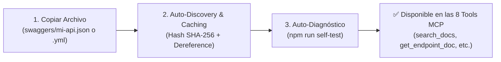

# MCP-DOC-MID: Servidor MCP para OpenAPI y Generación de Integraciones

Servidor de grado empresarial para el ecosistema **Model Context Protocol (MCP)** en Node.js (ES Modules), especializado en **aprender, dereferenciar (`$ref`) y permitir que un LLM consulte especificaciones OpenAPI/Swagger y genere integraciones de código listas para producción**.

Utiliza `@apidevtools/swagger-parser` para resolver en memoria todos los apuntadores y esquemas de componentes al iniciar el servidor, y expone un catálogo de **8 herramientas MCP** diseñadas para búsqueda, inspección, validación y generación de clientes HTTP en múltiples lenguajes (TypeScript, Python, JavaScript, cURL, C#).

---

## 📚 Documentación Detallada

Para guías especializadas y diagramas completos, consulta:
- 🏛️ [**Guía de Arquitectura del Sistema** (`docs/ARCHITECTURE.md`)](file:///c:/Users/Manuel/Documents/vivaaerobus/Doters/MCP/mcp-docu-mid/docs/ARCHITECTURE.md): Diagramas de flujo, Session Binding, observabilidad, persistencia atómica y Circuit Breaker.
- 🛠️ [**Referencia de Herramientas MCP** (`docs/TOOLS_REFERENCE.md`)](file:///c:/Users/Manuel/Documents/vivaaerobus/Doters/MCP/mcp-docu-mid/docs/TOOLS_REFERENCE.md): Detalle exhaustivo de parámetros, esquemas JSON y ejemplos de respuesta de cada herramienta.
- 📂 [**Guía de Archivos Swagger / OpenAPI** (`docs/SWAGGER_GUIDE.md`)](file:///c:/Users/Manuel/Documents/vivaaerobus/Doters/MCP/mcp-docu-mid/docs/SWAGGER_GUIDE.md): Instrucciones para añadir, validar y organizar especificaciones `.yml` y `.json`.
- 📋 [**Especificación Estructural Doters API Internal** (`docs/MIDDLEWARE_API_SPEC.md`)](file:///c:/Users/Manuel/Documents/vivaaerobus/Doters/MCP/mcp-docu-mid/docs/MIDDLEWARE_API_SPEC.md): Análisis de los 110 endpoints, 221 DTOs, envoltorios de respuesta y 25 dominios de `middleware-api.json`.

---

## 🏛️ Características Principales

1. **Lectura y Dereference Automático (`swaggers/`)**:
   - Escaneo recursivo de archivos `.yml`, `.yaml` y `.json`.
   - Resolución completa de referencias `$ref` en componentes, parámetros y modelos.
2. **Generación de Integraciones de Código para LLM**:
   - `generate_integration_code`: Genera snippets y clientes fuertemente tipados para cualquier endpoint.
   - Soporte para TypeScript (`fetch`/`axios`), JavaScript, Python (`httpx`/`requests`), cURL y C#.
3. **Validación y Extracción de Seguridad**:
   - `validate_payload`: Comprobación previa de que un payload JSON cumpla con tipos y campos requeridos.
   - `get_security_schemes`: Extracción de esquemas de autenticación (Bearer tokens, API keys, OAuth2).
4. **Transporte Dual**:
   - **STDIO**: Integración estándar con Claude Desktop, Antigravity, Cursor y extensiones MCP.
   - **SSE / HTTP**: Servidor Express con `/sse`, `/messages`, `/metrics`, `/health` y `/dashboard`.
5. **Observabilidad y Seguridad**:
   - Logs dirigidos exclusivamente a `process.stderr` con **Pino**.
   - Métricas Prometheus (`prom-client`) en `/metrics`.
   - Session Binding y protección contra Session Hijacking en `/messages`.

---

## 🛣️ El Flujo de Integración en 3 Pasos (Zero-Code)

Para que la integración de nuevas APIs sea **100% escalable, sin fricción y sin tocar una sola línea de código**, el servidor implementa **Autodescubrimiento y Carga por Convención**:



### 1️⃣ Paso 1: Colocar el Archivo en `swaggers/`
Simplemente guarda tu archivo `.json`, `.yml` o `.yaml` en el directorio [`swaggers/`](file:///c:/Users/Manuel/Documents/vivaaerobus/Doters/MCP/mcp-docu-mid/swaggers).

#### 📁 Estructura Escalable Recomendada (Por Dominios o Microservicios):
El escáner es **recursivo**, por lo que puedes organizar tus archivos en subcarpetas temáticas a medida que crezca el número de APIs:

```text
swaggers/
├── middleware-api.json                # API Core Middleware
├── partners/
│   ├── avasa-car-rental.json          # Swagger de Avasa
│   └── iamsa-bus.json                 # Swagger de IAMSA
├── payments/
│   └── openpay-gateway.yml            # OpenAPI de Pasarelas de Pago
└── flights/
    └── viva-booking.yaml              # OpenAPI de Reservaciones Viva
```

> [!TIP]
> **Identificador Automático (`specId`)**:  
> El sistema genera el `specId` automáticamente a partir del nombre base del archivo:
> - `avasa-car-rental.json` $\rightarrow$ `specId: "avasa-car-rental"`
> - `openpay-gateway.yml` $\rightarrow$ `specId: "openpay-gateway"`

---

### 2️⃣ Paso 2: Verificar la Integridad con `npm run self-test`
No necesitas levantar clientes MCP ni reiniciar servidores a ciegas. Ejecuta en terminal:

```bash
npm run self-test
```

#### ¿Qué hace este comando en < 15 ms?
1. Detecta el nuevo archivo y calcula su hash SHA-256.
2. Resuelve y dereferencia automáticamente todos los apuntadores `$ref`.
3. Sanitiza referencias rotas o ausentes para que el servidor nunca colapse.
4. Genera el snapshot de alto rendimiento en `.cache/swaggers/`.
5. Muestra el resumen en tiempo real:

```json
{
  "status": "healthy",
  "checks": {
    "swaggers": {
      "status": "pass",
      "specsCount": 4,
      "endpointsCount": 285,
      "schemasCount": 412
    }
  }
}
```

---

### 3️⃣ Paso 3: Listo para Consultar por los Agentes y LLMs
De forma inmediata, las 8 herramientas MCP aprenden los nuevos endpoints y esquemas sin configuración adicional:

* **Búsqueda global**: `search_docs({ query: "renta autos" })` buscará en todos los swaggers a la vez.
* **Búsqueda filtrada**: `search_docs({ query: "renta", specId: "avasa-car-rental" })` consulta exclusivamente esa API.
* **Generación de código**: `generate_integration_code({ path: "/v1/cars/book", language: "typescript" })` generará el cliente tipado.
* **Validación de payloads**: `validate_payload({ schemaName: "CarBookingDto", payload: { ... } })` validará contra el nuevo modelo.

---

### 🏆 Buenas Prácticas para Garantizar Máxima Calidad en el LLM
Para que los modelos de lenguaje generen el mejor código y respuestas precisas al leer tus nuevos swaggers:

1. **Declarar la URL Base (`servers`)**:
   ```yaml
   servers:
     - url: https://api.vivaaerobus.com/v1
       description: Ambiente de Producción
   ```
2. **Incluir Ejemplos en los Schemas (`example` / `examples`)**: Los ejemplos permiten a la herramienta `generate_integration_code` y al LLM crear payloads de prueba realistas automáticamente.
3. **Usar Etiquetas Claras (`tags`)**: Agrupar por tags (ej. `[ "CarRental", "Payments", "Security" ]`) permite a los agentes filtrar colecciones de endpoints rápidamente con `search_docs({ tag: "Payments" })`.
4. **Declarar la Seguridad (`components.securitySchemes`)**: Especificar si usa `bearerFormat: JWT`, `ApiKey` o `OAuth2` para que la herramienta `get_security_schemes` exponga las cabeceras requeridas.

---

## 🛠️ Herramientas MCP Disponibles

| Herramienta | Descripción | Parámetros Principales |
| :--- | :--- | :--- |
| [`list_specs`](file:///c:/Users/Manuel/Documents/vivaaerobus/Doters/MCP/mcp-docu-mid/docs/TOOLS_REFERENCE.md#1-list_specs) | Lista todas las APIs cargadas con sus versiones, servidores y conteo de rutas. | *Ninguno* |
| [`search_docs`](file:///c:/Users/Manuel/Documents/vivaaerobus/Doters/MCP/mcp-docu-mid/docs/TOOLS_REFERENCE.md#2-search_docs) | Busca endpoints, modelos y descripciones por palabras clave. | `query` (req), `specId` (opt), `tag` (opt), `limit` (opt) |
| [`get_endpoint_doc`](file:///c:/Users/Manuel/Documents/vivaaerobus/Doters/MCP/mcp-docu-mid/docs/TOOLS_REFERENCE.md#3-get_endpoint_doc) | Obtiene la especificación completa y dereferenciada de un endpoint. | `path` (req), `method` (opt, default: GET), `specId` (opt) |
| [`get_schema_doc`](file:///c:/Users/Manuel/Documents/vivaaerobus/Doters/MCP/mcp-docu-mid/docs/TOOLS_REFERENCE.md#4-get_schema_doc) | Obtiene el modelo de datos / schema dereferenciado. | `schemaName` (req), `specId` (opt) |
| [`generate_integration_code`](file:///c:/Users/Manuel/Documents/vivaaerobus/Doters/MCP/mcp-docu-mid/docs/TOOLS_REFERENCE.md#5-generate_integration_code) | Genera código de cliente listo para producción (TS, Python, JS, cURL, C#). | `path` (req), `method` (opt), `language` (opt), `clientType` (opt) |
| [`get_security_schemes`](file:///c:/Users/Manuel/Documents/vivaaerobus/Doters/MCP/mcp-docu-mid/docs/TOOLS_REFERENCE.md#6-get_security_schemes) | Obtiene esquemas de autenticación y cabeceras requeridas. | `specId` (opt) |
| [`validate_payload`](file:///c:/Users/Manuel/Documents/vivaaerobus/Doters/MCP/mcp-docu-mid/docs/TOOLS_REFERENCE.md#7-validate_payload) | Valida un payload JSON contra el schema de un endpoint antes de invocarlo. | `schemaName` (req), `payload` (req), `specId` (opt) |
| [`query_api_knowledge`](file:///c:/Users/Manuel/Documents/vivaaerobus/Doters/MCP/mcp-docu-mid/docs/TOOLS_REFERENCE.md#8-query_api_knowledge) | Sintetiza respuestas a preguntas de negocio o arquitectura sobre las APIs. | `query` (req), `specId` (opt) |

---

## ⚙️ Variables de Entorno (`.env`)

| Variable | Descripción | Valor por Defecto |
| :--- | :--- | :--- |
| `TRANSPORT_MODE` | Modo de transporte (`stdio`, `sse`, `http`) | `stdio` |
| `PORT` | Puerto de escucha para modo SSE/HTTP | `3000` |
| `LOG_LEVEL` | Nivel de logs (`debug`, `info`, `warn`, `error`) | `info` |
| `MCP_API_KEY` | Llave secreta para autenticación de API | `default-mcp-secret-key` |
| `ENABLE_AUTH` | Habilitar/deshabilitar autenticación (`true`/`false`) | `true` |
| `ALLOWED_ORIGINS` | Orígenes permitidos para CORS | `*` |
| `DASHBOARD_USER` | Usuario para acceso al Dashboard web | `admin` |
| `DASHBOARD_PASSWORD`| Contraseña para acceso al Dashboard web | `admin` |
| `RATE_LIMIT_WINDOW_MS`| Ventana de tiempo para Rate Limit en ms | `900000` (15 min) |
| `RATE_LIMIT_MAX` | Máximo de peticiones por ventana | `1000` |
| `STATS_STORAGE_ENABLED`| Persistencia de estadísticas en disco | `true` |
| `STATS_STORAGE_PATH`| Ruta del archivo de persistencia | `data/stats.json` |
| `SWAGGERS_DIR` | Carpeta de especificaciones OpenAPI | `swaggers` |

---

## 🚀 Inicio Rápido

```bash
# 1. Instalar dependencias
npm install

# 2. Autodiagnóstico en runtime (<5ms)
npm run self-test

# 3. Iniciar en modo STDIO (predeterminado)
npm start

# 4. Iniciar en modo SSE / HTTP (servidor web)
TRANSPORT_MODE=sse PORT=3000 npm start
```

---

## 🧪 Pruebas Automatizadas y Benchmarks

El proyecto cuenta con una suite integral de pruebas con **116 tests pasando (100%)** y una cobertura superior al **93% en sentencias**:

```bash
# 1. Ejecutar suite completa de pruebas unitarias y de integración
npm test

# 2. Reporte de cobertura detallado con Vitest y V8 (>93% Stmts)
npm run test:coverage

# 3. Pruebas de carga de alta concurrencia (100 agentes concurrentes)
npm run test:load

# 4. Benchmark de latencia y throughput (<5ms)
npm run benchmark

# 5. Pipeline de integración continua (CI)
npm run test:ci
```

---

## 🐳 Despliegue con Docker

```bash
# Construir imagen Docker multi-stage
docker build -t mcp-doc-mid:latest .

# Ejecutar contenedor en modo SSE
docker run -p 3000:3000 -e TRANSPORT_MODE=sse mcp-doc-mid:latest
```
