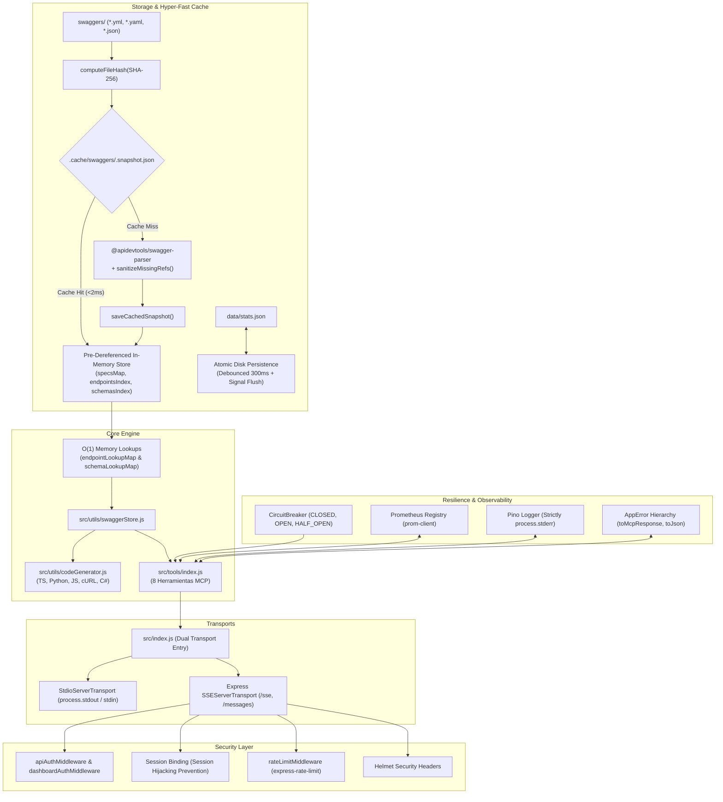

# Arquitectura del Servidor MCP-DOC-MID

**MCP-DOC-MID** es un servidor Model Context Protocol (MCP) de grado empresarial desarrollado sobre **Node.js (ES Modules)**, especializado en el aprendizaje, dereferenciación en memoria (`$ref`) y consulta de especificaciones OpenAPI/Swagger (`.yml`, `.yaml`, `.json`) para la generación asistida de integraciones de código.

---

## 📐 Diagrama de Arquitectura del Sistema

---

## 🏛️ Principios y Golden Rules Arquitectónicas

### 1. Cero Polución de `process.stdout` en Modo STDIO
En el protocolo Model Context Protocol (MCP) en modo STDIO, el canal `process.stdout` está reservado **estrictamente** para el intercambio de mensajes en formato JSON-RPC.
- Cualquier log emitido vía `console.log` o salida estándar no controlada corrompe el flujo de datos y desconecta el cliente MCP (Claude Desktop, Antigravity, Cursor).
- Todos los eventos de logging se canalizan mediante **Pino** dirigido exclusivamente a `process.stderr` ([src/utils/logger.js](file:///c:/Users/Manuel/Documents/vivaaerobus/Doters/MCP/mcp-docu-mid/src/utils/logger.js)).
- La carga de variables de entorno con `dotenv` ([src/utils/config.js](file:///c:/Users/Manuel/Documents/vivaaerobus/Doters/MCP/mcp-docu-mid/src/utils/config.js)) silencia temporalmente `console.log` para evitar mensajes informativos no deseados durante el arranque.

### 2. Doble Modo de Transporte (Dual Transport)
El servidor soporta dos modalidades de ejecución intercambiables mediante la variable `TRANSPORT_MODE`:
- **Modo STDIO (`TRANSPORT_MODE=stdio`)**: Inicia `StdioServerTransport` conectado a `server.connect()`. Ideal para agentes CLI, IDEs locales y escritorios.
- **Modo SSE / HTTP (`TRANSPORT_MODE=sse` o `http`)**: Inicia una aplicación Express con transporte `SSEServerTransport` en `/sse`, endpoint de mensajes JSON-RPC en `/messages`, endpoint de Prometheus en `/metrics`, endpoints de salud en `/health`, `/health/ready`, `/health/diagnostic` y un Dashboard visual embebido en `/dashboard`.

### 3. Session Binding y Seguridad Enterprise
Para prevenir vulnerabilidades de **Session Hijacking** en despliegues distribuidos HTTP / SSE:
- Cuando un cliente se conecta a `GET /sse`, se autentica mediante `apiAuthMiddleware` (`x-api-key` o `Bearer Token`) y el transporte genera un `sessionId` único.
- El servidor registra el `sessionId` en un almacén de sesiones activas autorizadas (`registerAuthenticatedSession`).
- Las peticiones subsecuentes a `POST /messages?sessionId=...` pasan por `sessionBindingMiddleware`, el cual valida que el `sessionId` pertenezca a la sesión autorizada. Si la sesión no existe o expiró, retorna un código **403 Forbidden**.

### 4. Resiliencia con Circuit Breaker
Las operaciones críticas de consulta e indexación están protegidas mediante instancias de `CircuitBreaker` ([src/utils/resilience.js](file:///c:/Users/Manuel/Documents/vivaaerobus/Doters/MCP/mcp-docu-mid/src/utils/resilience.js)):
- **`CLOSED`**: Estado operativo normal.
- **`OPEN`**: Si los fallos superan el umbral configurado (`failureThreshold`), el circuito se abre inmediatamente y rechaza peticiones durante un periodo de enfriamiento (`cooldownMs`), arrojando `CircuitBreakerOpenError` (código HTTP 503).
- **`HALF_OPEN`**: Tras expirar el cooldown, se permite una petición de prueba para validar la recuperación del servicio.

### 5. Persistencia Atómica en Disco con Debounce
El módulo [src/utils/storage.js](file:///c:/Users/Manuel/Documents/vivaaerobus/Doters/MCP/mcp-docu-mid/src/utils/storage.js) almacena de manera segura las estadísticas acumuladas y bitácora de actividad:
- Utiliza **escrituras atómicas** (`.tmp` + `renameSync`) para prevenir corrupción de archivos ante caídas inesperadas de energía o procesos.
- Implementa un **debounce de 300 ms** para agrupar escrituras continuas y minimizar el I/O en disco.
- Registra listeners en las señales del sistema operativo (`SIGINT`, `SIGTERM`, `beforeExit`) para forzar un volcado síncrono antes del apagado.

### 6. Jerarquía de Errores con Serialización Dual
Todas las excepciones del sistema heredan de `AppError` ([src/errors/AppError.js](file:///c:/Users/Manuel/Documents/vivaaerobus/Doters/MCP/mcp-docu-mid/src/errors/AppError.js)), permitiendo dos formas de serialización:
- `.toMcpResponse()`: Formato MCP estandarizado `{ isError: true, content: [{ type: 'text', text: '[CODE] mensaje' }] }`.
- `.toJson()`: Estructura JSON estándar para APIs HTTP con código de estado HTTP adecuado (400, 401, 403, 404, 429, 502, 503, 500).

### 7. Estrategia de Pruebas y Diagnóstico en Runtime
La fiabilidad del servidor está garantizada por una suite de pruebas multinivel:
- **Pruebas Unitarias (`tests/unit/`)**: Cobertura exhaustiva sobre `selfTest`, `storage`, `codeGenerator`, `swaggerStore`, `metrics` y las 8 herramientas MCP.
- **Pruebas de Integración (`tests/integration/`)**: Validación de ciclo de vida del servidor Express SSE, CORS, Session Binding y seguridad.
- **Pruebas de Contrato (`tests/contract/`)**: Verificación del cumplimiento del protocolo JSON-RPC de Model Context Protocol.
- **Pruebas de Carga (`tests/load/`)**: Simulación de 100 agentes concurrentes consultando documentación.
- **Diagnóstico en Tiempo Real (`npm run self-test`)**: Comprobación integral instantánea (<5ms) de configuración, esquemas de herramientas, registro de Prometheus, integridad de almacenamiento y conteo de endpoints/schemas cargados.

