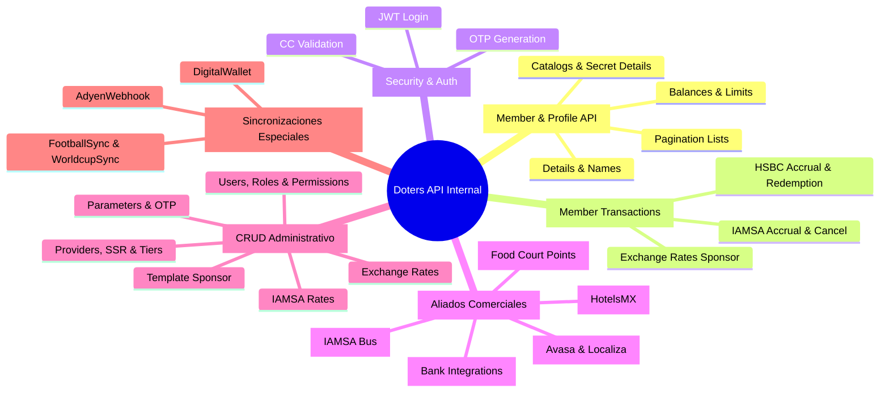

# Especificación Estructural: Doters API - Internal (`middleware-api.json`)

Este documento presenta el análisis técnico y estructural exhaustivo de la especificación de referencia **Doters API - Internal** ([swaggers/middleware-api.json](file:///c:/Users/Manuel/Documents/vivaaerobus/Doters/MCP/mcp-docu-mid/swaggers/middleware-api.json)), la cual define la arquitectura de servicios, contratos de datos, envolturas de respuesta y dominios de negocio que gobiernan la plataforma.

---

## 📊 Métricas y Dimensiones de la API

- **Nombre / Título**: `Doters API - Internal`
- **Versión OpenAPI**: `3.0.0`
- **Versión de la API**: `2.0`
- **Total de Rutas (Endpoints)**: **110 rutas**
- **Total de Operaciones HTTP**: **140 operaciones**
- **Total de Schemas / DTOs**: **221 modelos de datos**
- **Esquemas de Autenticación**:
  - `bearer`: JWT Bearer Token (`scheme: 'bearer', bearerFormat: 'JWT', type: 'http'`)
  - `basic`: HTTP Basic Auth (`type: 'http', scheme: 'basic'`)

---

## 📦 Envoltorios Estándar de Respuesta (Response Envelopes)

Todos los servicios del ecosistema Doters siguen un patrón estricto de envoltorio tanto para respuestas exitosas como para escenarios de error:

### 1. Envoltorio Exitoso (`200 OK` / `201 Created`)
```json
{
  "data": {
    /* Payload específico del DTO de respuesta */
  },
  "type": "SUCCESS",
  "action": "CONTINUE"
}
```

### 2. Envoltorio de Error (`4xx` / `5xx`)
```json
{
  "error": {
    "message": "Descripción contextual del error o validación fallida",
    "code": "CÓDIGO_ESTANDAR_ERROR"
  },
  "type": "ERROR",
  "action": "CANCEL"
}
```

### 🚦 Matriz de Códigos de Estado HTTP

| Código | Significado | Escenario de Aplicación |
| :--- | :--- | :--- |
| `200` / `201` | **Éxito** | Operación procesada correctamente (`type: SUCCESS`, `action: CONTINUE`). |
| `400` | **Bad Request** | Validación de entrada fallida o campos obligatorios ausentes en el DTO. |
| `401` | **Unauthorized** | Token JWT no proporcionado, expirado o con firma inválida. |
| `403` | **Forbidden** | Token válido pero sin permisos/roles suficientes para el recurso. |
| `404` | **Not Found** | Socio, transacción, catálogo o recurso no encontrado. |
| `406` | **Not Acceptable** | El estado de la cuenta no es elegible para la operación (ej. cuenta bloqueada para redención). |
| `424` | **Failed Dependency** | Fallo en la comunicación o configuración con un servicio externo upstream. |
| `429` | **Rate Limit Exceeded**| Límite de peticiones por ventana de tiempo alcanzado. |
| `500` | **Internal Error** | Error inesperado no controlado en el servidor. |
| `502` / `503` | **Service Unavailable** | Circuit Breaker abierto o servicios core no disponibles. |

---

## 🗺️ Mapa de Dominios Funcionales (25 Tags)



---

## 🔍 Resumen Detallado por Dominio

### 1. `MemberApi` (Gestión de Socios)
- **`GET /v1/members/{memberId}/balances`**: Consulta de balance de puntos disponibles, transferidos y conversión a divisas.
- **`GET /v1/members/{memberId}/details`**: Información de perfil, tarjetas cobrand asociadas y estado de membresía.
- **`GET /v1/members/{memberId}/details/names`**: Nombres y apellidos oficiales registrados.
- **`GET /v1/members/{memberId}/details/tier`**: Nivel actual del socio (Green, Silver, Gold, Platinum).
- **`GET /v1/members/cc-id/{memberId}`**: Datos del socio vinculados a su ID de tarjeta de crédito.
- **`POST /v1/members/balanceLimit`**: Notificación y control de límites de balance.
- **`GET /v2/member-accounts/list`**: Listado paginado de cuentas con filtros por ciudad, email, fecha de nacimiento y fecha de registro.

### 2. `MemberTransactions` (Transacciones y Puntos)
- **`GET /v2/member-transactions/rates`**: Consulta de tasas de cambio de puntos por sponsor, tier, bracket y divisa (MXN/USD).
- **`POST /v1/member-transactions/accrual`**: Procesamiento masivo de transacciones de acumulación de puntos.
- **`POST /v1/member-transactions/points/cancel`**: Cancelación de transacciones de acumulación o redención por `hBitSourceGeneratedId`.
- **`GET /v2/member-transactions/list`**: Historial transaccional paginado con filtros por Bit ID, fechas, sponsor y categoría.

### 3. `CarRental` (Renta de Autos)
- **`POST /v1/member-transactions/points/accrual/avasa`**: Acumulación de puntos en Avasa.
- **`POST /v1/member-transactions/points/accrual/localiza`**: Acumulación de puntos en Localiza.
- **`POST /v1/member-transactions/points/redemption/localiza`**: Redención de puntos para renta de autos en Localiza.
- **`POST /v1/member-transactions/points/accrual/simulate/localiza`**: Simulación de cálculo de puntos sin impactar balance.

### 4. `Bus` (Transporte Terrestre IAMSA)
- **`POST /v1/member-transactions/points/iamsa`**: Transacción dual de acumulación y redención de boletos de autobús.
- **`POST /v1/member-transactions/points/iamsa/sequential`**: Ejecución secuencial estricta de pagos mixtos puntos + efectivo.
- **`POST /v1/member-transactions/points/iamsa/cancel`**: Cancelación y reversa de boletos.
- **`GET /v1/member-transactions/iamsa-rates`**: Catálogo de tasas de conversión de IAMSA.

### 5. `Security` & `Banks`
- **`POST /v1/security/login`**: Autenticación de usuarios y emisión de JWT.
- **`POST /v1/security/generate-otp`**: Generación de códigos de un solo uso (OTP) para validaciones críticas.
- **`POST /v1/security/cc-validation`**: Validación de tarjetas de crédito del programa.
- **`POST /v1/member-name-comparison`**: Comparación fonética y ortográfica de nombres entre bancos y registros de Doters.

### 6. `CrudOperations/*` (Panel de Control y Configuración)
- Control de roles, permisos, catálogos de proveedores, tasas de cambio dinámicas, plantillas de sponsors, parámetros globales del sistema y niveles de lealtad (Tier).
