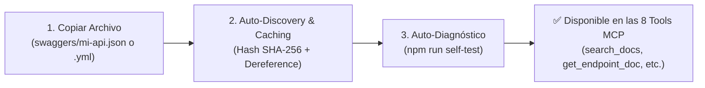

# Guía de Gestión y Escalabilidad de Archivos Swagger / OpenAPI (`swaggers/`)

El servidor **MCP-DOC-MID** utiliza el directorio `swaggers/` como su base de conocimiento principal. La arquitectura fue diseñada bajo el principio de **Autodescubrimiento y Carga por Convención**, permitiendo que agregar nuevas documentaciones sea **100% escalable, sin fricción y sin tocar una sola línea de código**.

---

## 📁 Formatos y Versiones Soportadas

El motor `@apidevtools/swagger-parser` soporta:
- **OpenAPI 3.1.x** (`.yml`, `.yaml`, `.json`)
- **OpenAPI 3.0.x** (`.yml`, `.yaml`, `.json`)
- **Swagger 2.0** (`.yml`, `.yaml`, `.json`)

---

## 🛣️ Flujo de Integración Escalable en 3 Pasos (Zero-Code)



---

## 🚀 1. Cómo Agregar Nuevas Especificaciones

### A. Organización por Dominios o Microservicios
El escáner del servidor es **recursivo**, por lo que puedes organizar tus archivos en subcarpetas temáticas a medida que crezca el ecosistema de APIs:

```text
swaggers/
├── middleware-api.json                # API Core Middleware
├── partners/
│   ├── avasa-car-rental.json          # Swagger de Avasa
│   └── iamsa-bus.json                 # Swagger de IAMSA
├── payments/
│   └── openpay-gateway.yml            # OpenAPI de Pasarelas de Pago
└── flights/
    └── viva-booking.yaml              # OpenAPI de Reservaciones Viva
```

### B. Generación Automática del Identificador (`specId`)
El sistema genera el `specId` automáticamente a partir del nombre base del archivo sin extensión:
- `swaggers/middleware-api.json` $\rightarrow$ `specId: "middleware-api"`
- `swaggers/partners/avasa-car-rental.json` $\rightarrow$ `specId: "avasa-car-rental"`
- `swaggers/payments/openpay-gateway.yml` $\rightarrow$ `specId: "openpay-gateway"`

---

## 🔍 2. Consultas Multi-Swagger en las Herramientas MCP

Una vez colocado el archivo, las **8 herramientas MCP** indexan automáticamente las rutas y modelos:

1. **Búsqueda Global (Cross-Spec)**:
   - `search_docs({ query: "puntos" })` busca simultáneamente en todas las APIs registradas.
2. **Búsqueda Filtrada por API**:
   - `search_docs({ query: "puntos", specId: "avasa-car-rental" })` restringe la búsqueda a esa especificación específica.
3. **Obtención de Endpoints y Schemas**:
   - `get_endpoint_doc({ path: "/v1/cars/book", method: "POST" })`
   - `get_schema_doc({ schemaName: "CarBookingDto" })`
4. **Generación de Clientes de Integración**:
   - `generate_integration_code({ path: "/v1/cars/book", language: "typescript" })`

---

## ⚡ 3. Estrategia de Carga Hiper-Rápida (Snapshot Caching)

Para soportar decenas de especificaciones voluminosas sin ralentizar el arranque:
1. **Validación por Hash SHA-256**: Al leer cada archivo, se calcula un hash criptográfico basado en su contenido y timestamp (`mtimeMs`).
2. **Snapshot en `.cache/swaggers/`**: El resultado del dereference completo se guarda como un snapshot JSON pre-calculado.
3. **Hidratación en < 2 ms**: En inicios subsecuentes, el servidor verifica el hash y restaura directamente la memoria en **1 a 3 ms**, evitando el costo de CPU de parsear el AST de OpenAPI repetidamente.
4. **Invalidación Automática**: Si editas cualquier archivo `.yml` o `.json`, el hash cambia y el sistema re-dereferencia el archivo de manera transparente.
5. **Índices en Memoria $O(1)$**: Las consultas a `getEndpointDoc` y `getSchemaDoc` resuelven en $O(1)$ mediante tablas hash compuestas (`METHOD:PATH` y `SCHEMANAME`).

---

## 🧪 4. Auto-Diagnóstico Inmediato (`npm run self-test`)

Para verificar que un nuevo archivo fue integrado correctamente sin errores de sintaxis o `$ref` rotos:

```bash
npm run self-test
```

El diagnóstico validará en < 15 ms:
- Que no haya referencias circulares o rotas.
- El conteo actualizado de `specsCount`, `endpointsCount` y `schemasCount`.
- Que el servidor esté en estado `healthy`.

---

## 🐳 5. Actualización en Caliente en Producción (Docker)

El contenedor Docker y `docker-compose.yml` mapean el volumen `./swaggers:/app/swaggers:ro`.  
Esto significa que para agregar o actualizar una API en producción **no es necesario reconstruir la imagen Docker ni reiniciar el contenedor**: basta con colocar el archivo en la carpeta `swaggers/` del host.

---

## 🏆 Buenas Prácticas para Especificaciones OpenAPI

1. **Incluir Título y Versión**: Asegúrate de que la sección `info` incluya `title`, `version` y `description`.
2. **Definir Servidores Base (`servers`)**: Define la URL base de tu API en `servers: [{ url: "https://api.empresa.com/v1" }]` para que los snippets generados apunten al host correcto.
3. **Documentar Ejemplos (`example` / `examples`)**: Agregar ejemplos en los esquemas permite al generador de código crear payloads y valores de prueba realistas para los LLMs.
4. **Definir `securitySchemes`**: Declarar tus esquemas de seguridad en `components.securitySchemes` para que la herramienta `get_security_schemes` los exponga al cliente.
